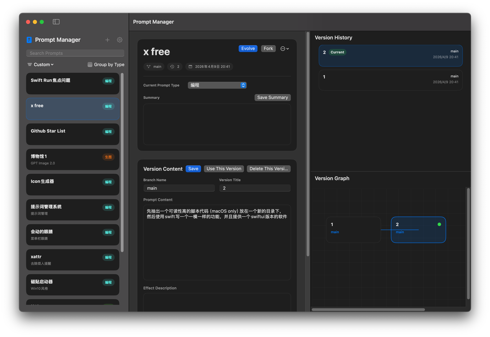

# Prompt Manager

[中文说明 / Chinese Version](./README.zh-CN.md)

Prompt Manager is a macOS SwiftUI app for organizing prompts with custom types, version history, branching, visual version relationships, search, grouping, import/export, theme switching, and Chinese/English UI support.

> Built with OpenCode / GPT-5.4 and GPT-5.5 vibe coding.

## Screenshot



## Features

- Create prompt entries with a name, type, and summary first, then refine prompt content later
- Define custom prompt types and assign colors with a native color picker
- Search prompts by name, summary, type, version title, version content, and effect description
- Sort the sidebar by time, custom order, or alphabetically
- Group sidebar prompts by type
- Reorder prompts manually in custom sort mode
- Manage prompt versions with:
  - evolution from the current version
  - branching from any version
  - switching the active version
  - deleting leaf versions
- Visualize version relationships with a graph view and smooth connection curves
- Keep version history and graph side by side in the right panel
- Persist data locally
- Manage import, export, clear data, language, theme, and custom types from the settings panel
- Import and export the full data set as JSON
- Export a single prompt from the prompt context menu or workspace more-actions menu
- Merge imported data into the current library or replace it entirely
- Clear all data with a destructive confirmation step
- Switch between system, light, and dark appearance modes
- Switch UI language between Chinese and English
- Show app metadata from the standard macOS About panel, including developer, repository, and license

## Project Structure

- `PromptManager.xcodeproj`: standard macOS Xcode project
- `Sources/PromptManager`: SwiftUI source files
- `PromptManager/Assets.xcassets`: app icons and app assets
- `PromptManager/Info.plist`: app bundle metadata
- `project.yml`: XcodeGen project definition

## App Metadata

- Bundle identifier: `me.whynbnb.PromptManager`
- Developer: `WHYBBE`
- Repository: <https://github.com/WHYBBE/PromptManager>
- License: MIT License

`PromptManager/Info.plist` reads version values from Xcode build settings:

- `MARKETING_VERSION`
- `CURRENT_PROJECT_VERSION`

Keep `project.yml` and `PromptManager.xcodeproj/project.pbxproj` in sync when changing app metadata.

## Run The App

### Recommended: Xcode

1. Open `PromptManager.xcodeproj`
2. Select the `PromptManager` scheme
3. Run the app

### Regenerate The Xcode Project

If you update `project.yml`, regenerate the project with:

```bash
xcodegen generate
```

## Build From Command Line

Build the standard macOS app target with:

```bash
xcodebuild -project "PromptManager.xcodeproj" -scheme "PromptManager" -configuration Debug build
```

The repository also still contains a Swift Package manifest for source-level development compatibility:

```bash
swift build
```

## Data Storage

Prompt Manager stores its local data in Application Support:

```text
~/Library/Application Support/PromptManager/prompt-store.json
```

The app persists:

- custom types
- prompts
- versions
- selected prompt and selected version
- UI language setting
- appearance setting
- sidebar sort mode
- sidebar type grouping setting

## Import And Export

The app supports full-library JSON import and export.

Data actions live in the settings panel:

- Export all data
- Import data
- Clear all data

Single-prompt export is available from:

- the prompt context menu in the sidebar
- the workspace more-actions menu

Import offers two modes:

- Replace current data
- Merge into current data

During merge, prompt types are merged by both:

- matching type ID
- matching normalized type name

Imported prompts are remapped to the merged type IDs to avoid duplicate types when names already match.

## App Icon

The app uses fixed app icon assets from:

```text
PromptManager/Assets.xcassets/AppIcon.appiconset/
```

## Notes

- User content such as prompt names, summaries, branch names, and prompt bodies is not auto-translated
- The current localization layer is app-managed and does not yet use `.strings` files

## License

This project is licensed under the MIT License. See [`LICENSE`](./LICENSE).
