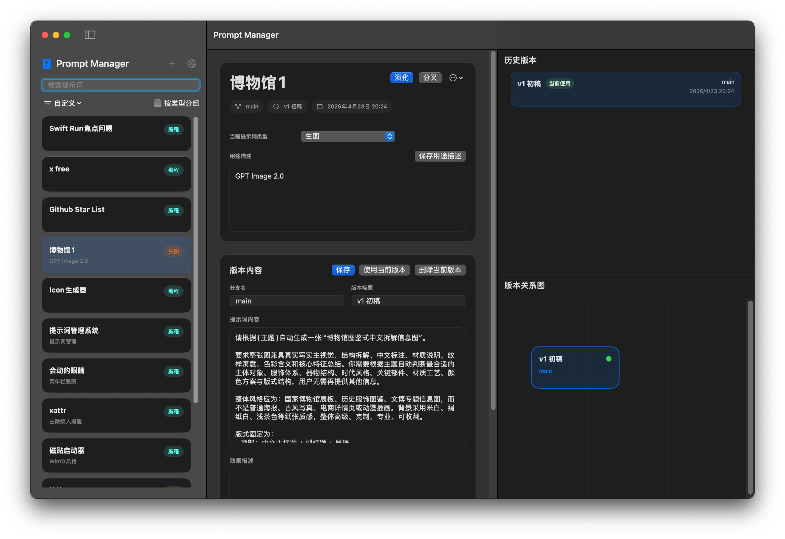

# Prompt Manager

[English Version](./README.md)

Prompt Manager 是一个基于 macOS SwiftUI 的提示词管理工具，支持自定义类型、版本历史、分叉、版本关系可视化、搜索、分组、导入导出、主题切换，以及中英文界面切换。

> 由 OpenCode / GPT-5.4 和 GPT-5.5 Vibe Coding 而成。

## 界面截图



## 功能特性

- 新建提示词时先填写名称、类型和用途描述，再继续完善提示词正文
- 支持自定义提示词类型，并使用系统取色器设置颜色
- 支持按名称、用途描述、类型、版本标题、版本内容和效果描述搜索提示词
- 支持按时间、自定义顺序和首字母排序左侧栏
- 支持按类型分组展示提示词
- 支持在自定义排序模式下手动调整提示词顺序
- 支持提示词版本管理：
  - 从当前版本继续演化
  - 从任意版本分叉
  - 切换当前使用版本
  - 删除叶子版本
- 支持通过关系图可视化版本之间的联系，并使用平滑曲线连接
- 右侧同时展示历史版本列表和版本关系图
- 支持本地持久化保存
- 设置面板集中管理导入、导出、清空数据、语言、主题和自定义类型
- 支持完整数据的 JSON 导入导出
- 支持从左侧右键菜单或中间栏更多菜单导出单个提示词
- 导入时可选择合并当前数据或覆盖当前数据
- 清空数据前会进行危险操作确认
- 支持系统 / 浅色 / 深色主题切换
- 支持中文 / English 界面切换
- 支持通过 macOS 标准关于面板查看开发者、仓库和许可证信息

## 项目结构

- `PromptManager.xcodeproj`：标准 macOS Xcode 工程
- `Sources/PromptManager`：SwiftUI 源码
- `PromptManager/Assets.xcassets`：应用图标和资源
- `PromptManager/Info.plist`：应用包信息
- `project.yml`：XcodeGen 工程定义文件

## 应用信息

- Bundle Identifier：`me.whynbnb.PromptManager`
- 开发者：`WHYBBE`
- 仓库：<https://github.com/WHYBBE/PromptManager>
- 许可证：MIT License

`PromptManager/Info.plist` 会从 Xcode build settings 中读取版本号：

- `MARKETING_VERSION`
- `CURRENT_PROJECT_VERSION`

修改应用元信息时，需要保持 `project.yml` 和 `PromptManager.xcodeproj/project.pbxproj` 同步。

## 运行方式

### 推荐方式：Xcode

1. 打开 `PromptManager.xcodeproj`
2. 选择 `PromptManager` scheme
3. 运行应用

### 重新生成 Xcode 工程

如果你修改了 `project.yml`，可以通过以下命令重新生成工程：

```bash
xcodegen generate
```

## 命令行构建

构建标准 macOS App：

```bash
xcodebuild -project "PromptManager.xcodeproj" -scheme "PromptManager" -configuration Debug build
```

仓库中目前仍保留了 Swift Package manifest，便于源码级开发兼容：

```bash
swift build
```

## 数据存储

Prompt Manager 会将本地数据保存到 Application Support：

```text
~/Library/Application Support/PromptManager/prompt-store.json
```

保存内容包括：

- 自定义类型
- 提示词
- 版本记录
- 当前选中提示词和版本
- 界面语言设置
- 主题设置
- 左侧栏排序方式
- 左侧栏是否按类型分组

## 导入与导出

应用支持完整提示词库的 JSON 导入导出。

数据操作位于设置面板：

- 导出全部数据
- 导入数据
- 清空数据

单个提示词导出入口位于：

- 左侧栏提示词右键菜单
- 中间栏更多菜单

导入支持两种模式：

- 覆盖当前数据
- 合并到当前数据

在合并模式下，类型会按以下规则合并：

- 类型 ID 相同
- 类型名称标准化后相同

导入的提示词会自动重映射到合并后的类型 ID，避免因为同名类型而出现重复类型。

## 应用图标

应用使用固定图标资源，位置为：

```text
PromptManager/Assets.xcassets/AppIcon.appiconset/
```

## 说明

- 用户内容如提示词名称、用途描述、分支名和正文不会自动翻译
- 当前本地化方案由应用内部控制，尚未切换到 `.strings` 文件

## License

本项目基于 MIT License 开源。详见 [`LICENSE`](./LICENSE)。
